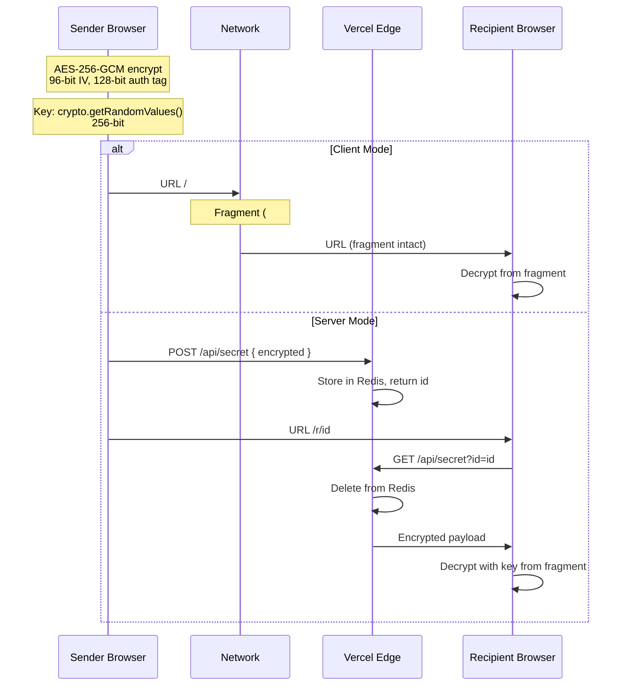

# CryptSend

**Zero-knowledge, end-to-end encrypted secret sharing.**

CryptSend lets you share passwords, tokens, and other sensitive data with a single link. Your secret is encrypted in your browser using **AES-256-GCM** and — depending on the mode — embedded directly into the URL or stored server-side for a guaranteed one-time view.

[](LICENSE)
[](SECURITY.md)

> **No account required. No tracking. Open source. MIT licensed.**

---

## Features

- **AES-256-GCM encryption** — authenticated encryption using the Web Crypto API
- **Client-side encryption** — your secret never leaves your browser unencrypted
- **Zero-knowledge** — the server never sees your plaintext or the decryption key
- **Password protection** — optional passphrase layer with PBKDF2-SHA-256 (600k iterations)
- **Two sharing modes:**
  - **Multi-view (client mode)** — encrypted payload in URL fragment, no server needed
  - **One-time (server mode)** — payload stored in Redis, deleted after first retrieval, requires [Upstash Redis](https://upstash.com)
- **Burn after reading** — secret cleared from the page after 30 seconds (client mode) or deleted from server on retrieval (server mode, requires Redis)
- **Expiry** — configurable TTL for server-stored secrets
- **Rate-limited API** — protects against brute-force and abuse
- **Privacy-first** — no analytics, no cookies, no tracking, no fingerprinting
- **Dark mode** — respects `prefers-color-scheme`
- **Accessible** — keyboard-navigable, screen-reader friendly, reduced-motion support
- **Security headers** — CSP, HSTS, X-Frame-Options, Referrer-Policy, Permissions-Policy
- **Open source** — fully transparent, auditable, self-hostable

---

## How It Works

```mermaid
sequenceDiagram
    participant Sender Browser
    participant Vercel Edge
    participant Recipient Browser

    Sender Browser->>Sender Browser: AES-256-GCM encrypt(secret, key)
    alt Client Mode (multi-view)
        Sender Browser->>Recipient Browser: /#&lt;encrypted&gt;.&lt;key&gt;
        Recipient Browser->>Recipient Browser: Decrypt from URL fragment
    else Server Mode (one-time)
        Sender Browser->>Vercel Edge: POST /api/secret { encrypted }
        Vercel Edge->>Vercel Edge: Store in Redis, return id
        Sender Browser->>Recipient Browser: /r/&lt;id&gt;#&lt;key&gt;
        Recipient Browser->>Vercel Edge: GET /api/secret?id=&lt;id&gt;
        Vercel Edge->>Recipient Browser: Encrypted payload (deleted)
        Recipient Browser->>Recipient Browser: Decrypt with key from fragment
    end
```

### Multi-View Mode (Client-Only, Default)

The encrypted payload and key are stored in the URL fragment (the part after `#`), which is never sent to any server. The recipient opens the link, the page reads the fragment, decrypts the secret in the browser, and displays it.

```
/#<base64url(IV + ciphertext + auth_tag)>.<base64url(key)>
```

Anyone with the full URL can view the secret.

### One-Time Mode (Server-Side Storage)

The encrypted payload is stored on the server (Redis). The URL contains an ID to fetch the payload, while the key remains in the fragment. When the recipient opens the link, the page fetches the encrypted payload from `/api/secret?id=<id>`, the API returns the payload and deletes it immediately from Redis, and the page decrypts using the key from the fragment.

```
/r/<id>#<key>
```

The server never has the key. Server mode provides a single-use payload, but the key must still be transmitted client-side.

### Password-Protected Mode (Client & Server)

Optionally protect any link with a passphrase. When enabled, the encryption key is derived from the passphrase using **PBKDF2-SHA-256** (600,000 iterations, 16-byte random salt). The salt is stored in the URL instead of the encryption key.

**URL formats:**

```
# <version>.<payload>.<salt>        Client mode (v2)
/r/<id>#<version>.<salt>            Server mode (v2)
```

- `version = 1` — key in URL, no password
- `version = 2` — password-protected (salt in URL, key derived from passphrase)

The passphrase is never transmitted or stored server-side.

> **Backward compatible:** links without a version prefix are treated as v1 automatically.

---

## Getting Started

### One-Click Deploy

[](https://vercel.com/new/clone?repository-url=https%3A%2F%2Fgithub.com%2FPatrykPanasiuk%2Fcryptsend)

### Manual Deploy

```bash
git clone https://github.com/PatrykPanasiuk/cryptsend.git
cd cryptsend
npm install
vercel --prod
```

### Local Development

```bash
npm install
npm run dev
```

### Enabling One-Time Mode (Server Storage)

For true one-time viewing with server-side storage, you need a Redis instance. [Upstash](https://upstash.com) offers a free tier (30 MB, enough for thousands of secrets).

1. Create a Redis database on [Upstash](https://console.upstash.com)
2. Copy your **REST URL** and **REST Token**
3. Add them to your Vercel project:

```bash
vercel env add KV_URL
# Paste your Upstash REST URL

vercel env add KV_REST_API_TOKEN
# Paste your Upstash REST Token

vercel env pull
```

4. Redeploy:

```bash
vercel --prod
```

Once configured, the "Burn after reading" toggle will enable server-side one-time mode with configurable expiry.

> **Alternative env var names:** You can also use `REDIS_URL` / `REDIS_TOKEN` or `UPSTASH_REDIS_REST_URL` / `UPSTASH_REDIS_REST_TOKEN`.

---

## Security Model



- **Key generation:** `crypto.getRandomValues()` — 256-bit key, cryptographically secure
- **Password-based key derivation:** PBKDF2-SHA-256, 600,000 iterations, 16-byte random salt
- **Encryption:** AES-256-GCM with 96-bit random IV and 128-bit authentication tag
- **Fragment security:** The URL fragment (`#...`) is never sent in HTTP requests — only the browser has access to it
- **No persistence:** No cookies, localStorage, or IndexedDB are used for secrets
- **CSP:** Content Security Policy restricts scripts, connections, and inline styles
- **Rate limiting:** API limited to 20 requests per IP per 60-second window

### Threat Model

#### What CryptSend Protects

- **Confidentiality in transit:** The plaintext secret is never transmitted over the network. Only the AES-256-GCM ciphertext leaves the browser.
- **Server-side confidentiality:** The server operator (Vercel, Upstash) sees only encrypted payloads. The decryption key is stored exclusively in the URL fragment and is never sent to any server.
- **Forward secrecy against server compromise:** Even if the server is compromised after a secret is delivered, the ciphertext grants no information about the plaintext without the key from the URL fragment.

#### What CryptSend Does NOT Protect Against

- **Compromised device:** Malware on the sender's or recipient's device can capture the secret before encryption or after decryption.
- **Malicious browser extensions:** Extensions can read the DOM, URL bar, and intercept Web Crypto API calls.
- **Clipboard managers:** Secrets copied to the clipboard remain accessible to other applications until overwritten.
- **Screen capture:** The decrypted secret is displayed in the browser and can be captured visually.
- **URL forwarding:** Anyone who receives the full URL, including the fragment, can access the secret. Fragment-based protection does not survive URL forwarding via channels that strip fragments.
- **Targeted link sharing:** The sender's intended recipient may share the link with others. CryptSend provides no access control.
- **Traffic analysis:** Metadata (IP addresses, request timing, payload sizes) is observable by network intermediaries and the server operator.
- **Browser vulnerabilities:** A compromised or buggy browser undermines all client-side cryptographic guarantees.

#### Client Mode Limitations

In client mode (no server storage), the encrypted payload and key are both in the URL fragment. Anyone who saves the URL before or after viewing can revisit the same link and decrypt the secret again. The 30-second client-side burn timer only clears the secret from the page — it does not destroy the URL.

#### Server Mode Limitations

In server mode, the encrypted payload is deleted from Redis after the first successful retrieval. This prevents replay of the stored payload. However:
- The key remains in the URL fragment and is transmitted client-side.
- A concurrent fetch (within the same millisecond) could both retrieve the payload before deletion.
- The Redis operator could theoretically log the payload before deletion (CryptSend has no control over the infrastructure operator's practices).

#### Assumptions

- The Web Crypto API implementation in the user's browser is correct and free from compromise.
- The user's operating system and browser are free from malware.
- For server mode: the Redis operator does not log or persist deleted keys beyond their TTL.
- HTTPS is properly configured and the TLS connection is not intercepted.
- The sender has correctly verified the recipient's identity before sharing the link.

---

## Project Structure

```
cryptsend/
├── index.html              # Main page (single-page application)
├── style.css               # Styles (dark/light mode)
├── script.js               # Client-side logic + Web Crypto API
├── api/
│   └── secret.mjs          # Serverless API (Redis storage, rate-limited)
├── package.json            # Dependencies and scripts
├── vercel.json             # Vercel deployment config + security headers
├── README.md               # This file
├── LICENSE                 # MIT License
├── CONTRIBUTING.md         # Contribution guidelines
├── CODE_OF_CONDUCT.md      # Code of Conduct
├── SECURITY.md             # Security policy
└── .gitignore              # Git ignore rules
```

---

## API Reference

### `POST /api/secret`

Store an encrypted payload server-side (requires Redis).

**Request:**

```json
{
  "encrypted": "<base64url-encoded AES-GCM payload>",
  "ttl": 86400
}
```

| Field       | Type     | Required | Default | Description                    |
|-------------|----------|----------|---------|--------------------------------|
| `encrypted` | string   | yes      | —       | Base64url-encoded encrypted payload |
| `ttl`       | number   | no       | 86400   | Time-to-live in seconds (60–604800) |

**Response `201 Created`:**

```json
{
  "id": "a1b2c3d4e5f6a7b8c9d0e1f2a3b4c5d6",
  "ttl": 86400
}
```

**Response `429 Too Many Requests`:** Rate limit exceeded.

**Response `503 Service Unavailable`:** Redis not configured.

### `GET /api/secret?id=<id>`

Retrieve a secret. The secret is **deleted immediately** after retrieval (one-time read).

| Parameter | Type   | Required | Description                    |
|-----------|--------|----------|--------------------------------|
| `id`      | string | yes      | 32-character hex secret ID     |

**Response `200 OK`:**

```json
{
  "encrypted": "<base64url-encoded AES-GCM payload>"
}
```

**Response `404 Not Found`:** Secret already viewed, expired, or never existed.

**Response `429 Too Many Requests`:** Rate limit exceeded.

---

## Future Improvements

- [x] **Password-protected secrets** — passphrase derived via PBKDF2-SHA-256 (600k iterations)
- [ ] **Custom expiry per view** — sender sets exact expiration date/time
- [ ] **Browser extension** — right-click → send as encrypted secret
- [ ] **CLI tool** — `npx cryptsend send "my secret"` for terminal usage
- [ ] **QR code sharing** — scan to open the secret on mobile
- [ ] **Email delivery** — optional email sending via Resend / SendGrid
- [ ] **Webhook notifications** — notify sender when secret is viewed
- [ ] **Bulk operations** — share multiple secrets in a single batch
- [ ] **Teams & workspaces** — shared team secret inboxes
- [ ] **Audit log** — record who viewed what (for enterprise deployments)
- [ ] **i18n** — internationalization for non-English interfaces

---

## Tech Stack

- **Runtime:** Browser (Web Crypto API + vanilla JS)
- **Encryption:** AES-256-GCM
- **Serverless:** Vercel Functions (Node.js)
- **Storage:** Upstash Redis (optional, for one-time mode)
- **Deployment:** Vercel

---

## Contributing

Contributions are welcome! Please read [CONTRIBUTING.md](CONTRIBUTING.md) and [CODE_OF_CONDUCT.md](CODE_OF_CONDUCT.md) before submitting a pull request.

---

## License

[MIT](LICENSE) © [Patryk Panasiuk](https://github.com/PatrykPanasiuk)
